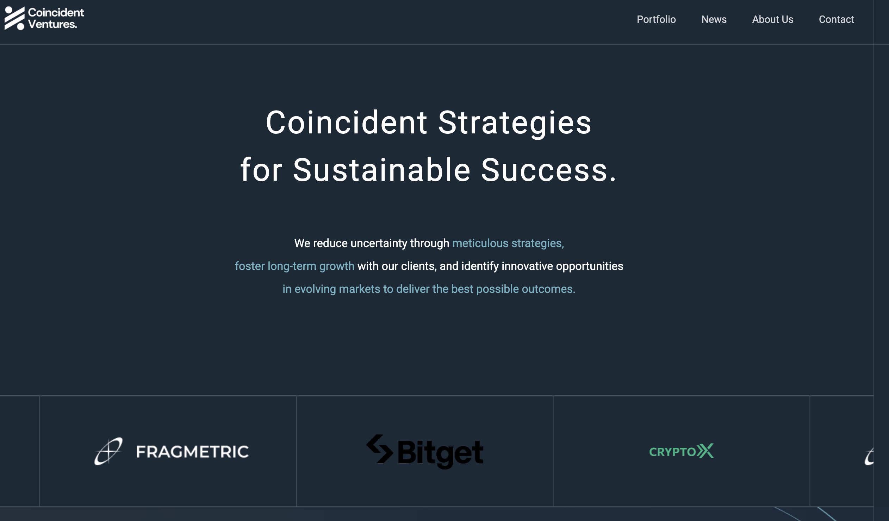

# Coincident Ventures Showcase

Coincident Ventures is our innovative crypto portfolio management platform that leverages modern web technologies to help users track and manage their digital asset investments. This repository serves as a showcase of our platform's architecture, design, and features.




## Table of Contents

- [Overview](#overview)
- [Features](#features)
- [Getting Started](#getting-started)
- [Development](#development)
- [Production](#production)
- [Deployment](#deployment)
- [Preview](#preview)
- [License](#license)

## Overview

Built on the Nuxt Minimal Starter, this project demonstrates a responsive, user-friendly interface for managing crypto portfolios. It integrates with industry APIs to deliver real-time market insights and supports serverless functions for additional features like contact form handling.

## Features

- **Responsive, Mobile-First Design:** Optimized for various devices.
- **Real-Time Data Integration:** Connects to crypto market and news APIs.
- **Modern UI/UX:** Clean, professional design with intuitive navigation.
- **Serverless Functions:** Efficient back-end processing (e.g., contact form submissions).

## Getting Started

### Prerequisites

- [Node.js](https://nodejs.org/) v14 or higher
- Your preferred package manager: npm, pnpm, yarn, or bun

### Installation

Clone the repository and install dependencies:

```bash
# Clone the repository
git clone https://github.com/sik247/coincident.git
cd coincident

# Install dependencies (choose one)
npm install
# pnpm install
# yarn install
# bun install
```
